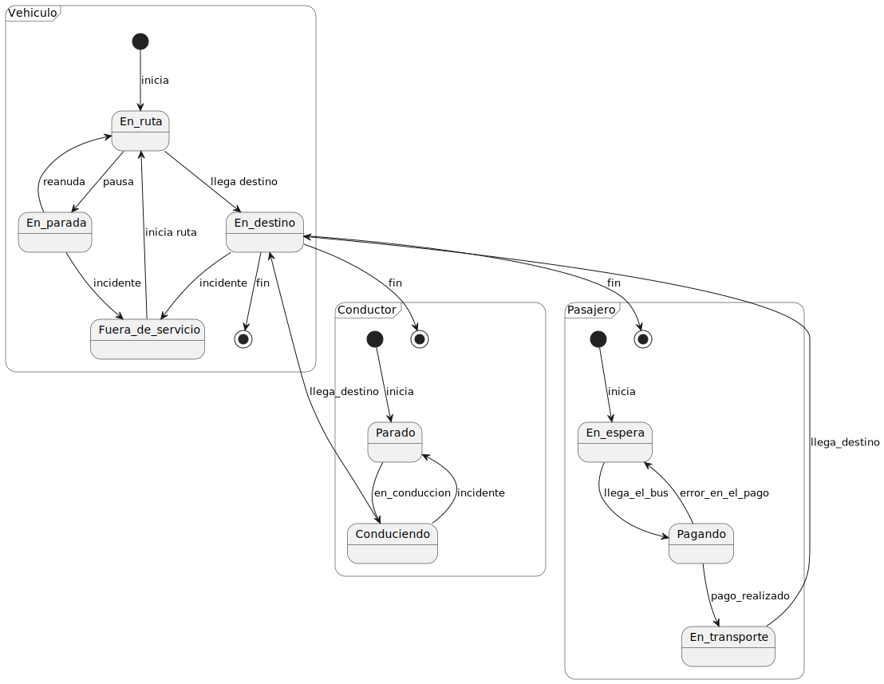

# Examen Parcial - Ingenieria de Software I

Este repositorio contiene el examen parcial de Ingenieria de Software I, incluyendo el examen escaneado, los diagramas solicitados en PlantUML, y la actividad post-parcial con mejoras.

---

## Examen Escaneado

A continuación, puedes ver el examen escaneado en formato PDF:

- [Examen Parcial Escaneado](./documents/parcial.pdf)

---

## Diagramas en PlantUML

### Diagrama de Clases

- [Archivo PlantUML](./modelosUML/examenParcial/diagramaClases.puml)
- 

### Diagrama de Objetos

- [Archivo PlantUML](./modelosUML/examenParcial/diagramaObjetos.puml)
- 

---

### Diagrama de Estados - Vehículo

- [Archivo PlantUML](./modelosUML/examenParcial/diagramaEstadosVehiculo.puml)
- 

### Diagrama de Estados - Conductor

- [Archivo PlantUML](./modelosUML/examenParcial/diagramaEstadosConductor.puml)
- 

### Diagrama de Estados - Pasajero

- [Archivo PlantUML](./modelosUML/examenParcial/diagramaEstadosPasajero.puml)
- 

---

## Actividad Post-Parcial - Mejoras

Como parte de la actividad post-parcial, se realizaron mejoras en el modelado de los diagramas de clases y de objetos, basándose en los diagramas de estados creados para el examen. Además, se ha creado un diagrama de estados global que integra las interacciones de todos los actores. A continuación, se muestran las mejoras en los diagramas:

### Diagrama de Clases Mejorado

- [Archivo PlantUML](./modelosUML/actividadPostParcial/diagramaClases.puml)
- 

### Diagrama de Objetos Mejorado

- [Archivo PlantUML](./modelosUML/actividadPostParcial/diagramaObjetos.puml)
- 

### Diagrama de Estados Global

Este diagrama de estados global muestra la interacción y flujo general entre el **Vehículo**, **Conductor**, y **Pasajero** en el sistema.

- [Archivo PlantUML](./modelosUML/actividadPostParcial/diagramaEstados.puml)
- 

---

Este repositorio organiza la información de manera estructurada, facilitando la revisión de los diagramas y las mejoras implementadas en la actividad post-parcial.
